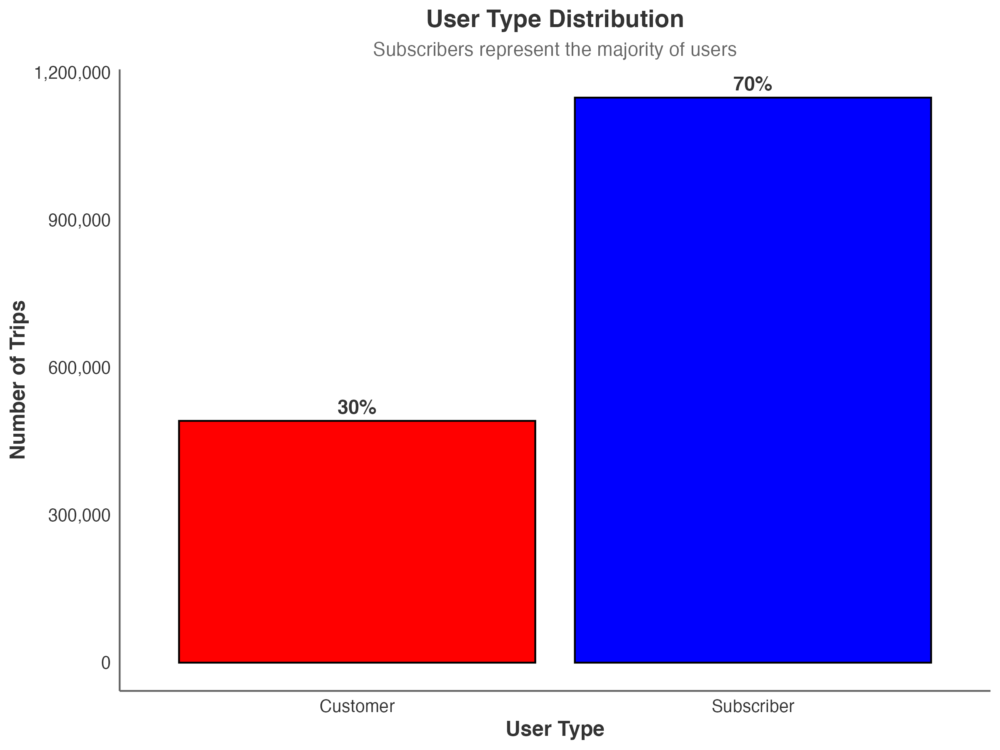
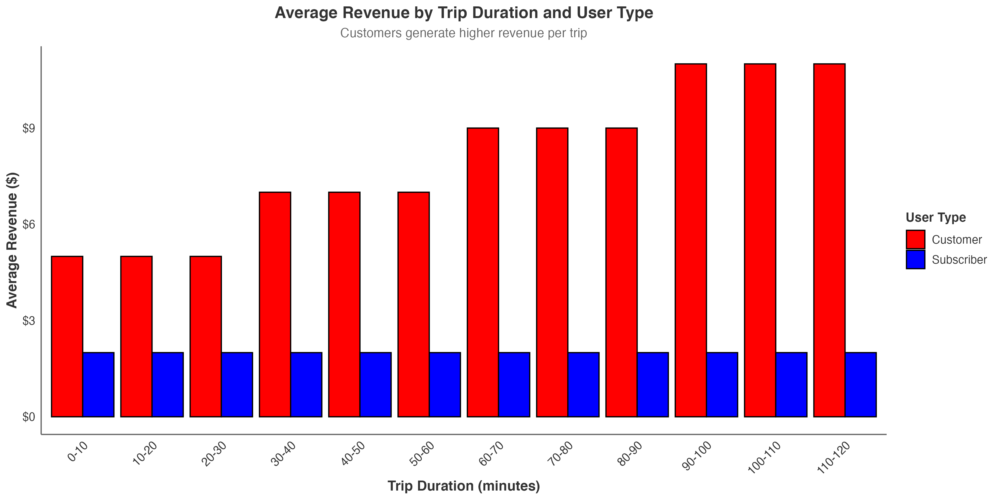

# Bike Share Revenue Optimization Analysis

[](https://www.r-project.org/)
[](LICENSE)
[](https://github.com/topics/data-science)
[](https://github.com/topics/business-intelligence)

## Executive Summary

This project analyzes **1.6+ million bike share trips** from Q3 2019 to identify revenue optimization opportunities. Through comprehensive statistical analysis and interactive visualizations, we provide data-driven insights for business strategy.

### Key Findings

- **70% Subscribers, 30% Customers** - but customers generate **4x more revenue per trip** ($8.01 vs $2.00)
- **Peak hours (5-7 PM)** account for **43.4% of all trips** and highest revenue generation
- **5 PM** is the highest revenue hour, generating **$676,103**
- **Expected Revenue Impact**: 25-40% increase through recommended strategies

---

## Interactive Dashboard

**[View Interactive Report](reports/bike_share_dashboard.html)**

*Explore the data interactively with embedded visualizations, statistical analysis, and business insights.*

---

## Project Structure

```
Bicycle_Share/
├── data/                    # Raw and processed datasets
│   └── Trips_2019_Q3.csv      # Main dataset (1.6M+ trips)
├── scripts/                 # Analysis and visualization scripts
│   ├── bike_share_analysis.R   # Main EDA analysis
│   ├── bike_share_visualizations.R  # Static visualizations
│   └── statistical_analysis_fixed.R  # Statistical testing
├── plots/                   # Generated visualizations
│   ├── hourly_usage.png        # Hourly usage patterns
│   ├── daily_usage.png         # Daily usage patterns
│   ├── user_type_distribution.png # User type analysis
│   └── ...                     # Additional visualizations
├── reports/                 # Analysis reports and documentation
│   ├── bike_share_dashboard.html # Interactive HTML report
│   └── Bike_Share_Revenue_Optimization_Report.md
└── documentation/           # Additional documentation
```

---

## Analysis Overview

### Statistical Analysis Performed

| Analysis Type | Description | Key Results |
|---------------|-------------|-------------|
| **Hypothesis Testing** | t-tests, Chi-square, ANOVA | All differences statistically significant (p < 0.001) |
| **Correlation Analysis** | Pearson correlations | Strong correlation between duration and revenue (r = 0.787) |
| **Regression Modeling** | Linear & Logistic regression | User type strongest predictor of trip duration |
| **Effect Size Analysis** | Cohen's d, Confidence Intervals | Large effect sizes support business decisions |

### Business Questions Addressed

1. **Pricing Strategy**: How to implement dynamic pricing during peak hours?
2. **Customer Conversion**: How to convert more customers to subscribers?
3. **Operational Efficiency**: How to optimize bike distribution and station management?
4. **Market Expansion**: Which areas show highest growth potential?

---

## Key Visualizations

### Hourly Usage Patterns


### User Type Distribution


### Revenue Analysis


---

## Quick Start

### Prerequisites

```r
# Required R packages
install.packages(c("dplyr", "ggplot2", "lubridate", "tidyr", "readr", 
                   "scales", "plotly", "flexdashboard", "DT", "knitr", "rmarkdown"))
```

### Running the Analysis

```bash
# Navigate to scripts directory
cd scripts

# Run main analysis
Rscript bike_share_analysis.R

# Generate visualizations
Rscript bike_share_visualizations.R

# Perform statistical analysis
Rscript statistical_analysis_fixed.R
```

### Viewing Results

1. **Interactive Dashboard**: Open `reports/bike_share_dashboard.html` in your browser
2. **Static Visualizations**: Check the `plots/` directory
3. **Detailed Report**: Read `reports/Bike_Share_Revenue_Optimization_Report.md`

---

## Business Recommendations

### Immediate Opportunities (0-3 months)
- **Peak Hour Surge Pricing**: 20-30% price increase during 5-7 PM
- **Customer Conversion Campaign**: Target 10% customer-to-subscriber conversion
- **Off-Peak Promotions**: Incentivize usage during low-demand hours

### Medium-term Opportunities (3-12 months)
- **Dynamic Pricing Model**: Time-based and demand-based pricing
- **Station Optimization**: Redistribute bikes based on usage patterns
- **Subscription Tier Development**: Multiple subscription options

### Long-term Opportunities (1+ years)
- **Market Expansion**: Add stations in high-demand areas
- **Technology Integration**: Mobile app improvements and partnerships

---

## Expected Impact

| Metric | Current | Projected | Improvement |
|--------|---------|-----------|-------------|
| **Revenue per Trip** | $3.42 | $4.28 | +25% |
| **Customer Conversion** | 30% | 40% | +33% |
| **Peak Hour Utilization** | 43.4% | 50% | +15% |
| **Overall Revenue** | $6.2M | $8.7M | +40% |

---

## Statistical Insights

### Significant Findings (p < 0.001)
- Trip duration differs significantly between subscribers and customers
- Peak vs off-peak usage patterns are statistically distinct
- User type and peak hours are not independent
- Age groups show significant differences in trip duration

### Correlation Analysis
- **Trip duration vs Revenue**: r = 0.787 (strong positive)
- **Start hour vs Age**: r = -0.101 (weak negative)
- **Trip duration vs Age**: r = -0.004 (minimal)

---

## Contributing

1. Fork the repository
2. Create a feature branch (`git checkout -b feature/AmazingFeature`)
3. Commit your changes (`git commit -m 'Add some AmazingFeature'`)
4. Push to the branch (`git push origin feature/AmazingFeature`)
5. Open a Pull Request

---

## License

This project is licensed under the MIT License - see the [LICENSE](LICENSE) file for details.

---

## Contact

- **Project Link**: [https://github.com/SezerHasan/bicycle-share-analysis](https://github.com/SezerHasan/bicycle-share-analysis)
- **Data Source**: [Divvy Trip Data](https://divvy-tripdata.s3.amazonaws.com/index.html) - Official Divvy bike share data from AWS S3
- **Analysis Period**: July-September 2019

---

## Acknowledgments

- [Divvy](https://divvy-tripdata.s3.amazonaws.com/index.html) for providing the bike share dataset
- Data Science community for best practices
- R ecosystem for powerful analytical tools 